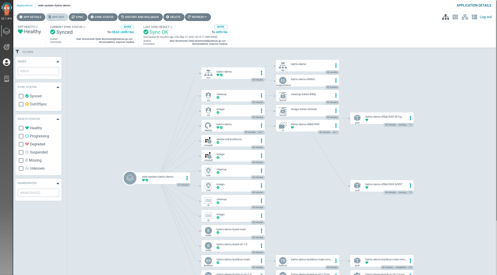

# terragrunt-experiment

## What you'll need

### Secrets & Variables

**tl;dr**

- Docker secrets
- Github API token (read/write)
- A digital ocean API token

The module currently requires the following secrets

```sh
export TF_VAR_do_token=$(pass digital-ocean-doctl-token)
export TF_VAR_registry_read_token=$(pass dockerhub-k8s-read)
export TF_VAR_registry_write_token=$(pass dockerhub-k8s-write)
export TF_VAR_github_read_token=$(pass github-api-read)
export TF_VAR_github_deploy_token=$(pass github-deploy-key-gen)
```

Along with the following variables:

```
# terraform.tfvars
cluster_name = "liatrio-demo"
domain_name = "happylittlecloud.xyz"

github_username = "blairdrummond"
github_repo = "terragrunt-experiment-manifests"

registry_server = "https://index.docker.io/v1/"
registry_username = "blairdrummond"
```

If you change the github username and docker username, you will also need to replace them in the [ArgoCD Manifests repository](https://github.com/blairdrummond/terragrunt-experiment-manifests). 

**If you deploy without docker secrets, most things will work. You just won't be building images.**

The git credentials are to read the private repositories, and argo events uses a credential to auto-configure a github webhook. If the repos become public, these would also be unnecessary.

#### DNS

I pointed `happylittlecloud.xyz` to the digitalocean nameservers in advance so that I can use the domain for the purpose of this demo. If you have a free domain, you can use it --- you need to modify this repo, and unfortunately **you also will need to modify the annotation on the ingress controller in the manifests repo**.


### Tools

- doctl
- terragrunt
- terraform
- [task](https://taskfile.dev/#/installation)

**Optional:**
- k3d (Note, the metallb configuration might be Linux Only?)

## How to run

- Pray to the demo gods
- Configure secrets (either as env vars or with secrets.env)
- `. ./secrets.env` (to source the secrets)
- Run `task prod` (or `task all` if you're on linux and have `k3d`)

## Log into ArgoCD


**Note, you may first want to run `task login:doctl` to log into digitalocean.**

Once your clusters are up, switch to the context you'd like to see (either the k3d or prod cluster), and run `task login:argo-cd`. You'll see

```sh
➜  terragrunt-experiment-infra git:(main) ✗ task login:argo-cd
=== kube context ========
k3d-liatrio-demo
=== ArgoCD Login ========
username: admin
password: XXXXXXXXXXXXXXXX
=========================
Forwarding from 127.0.0.1:8000 -> 8080
Forwarding from [::1]:8000 -> 8080
```

This will print credentials for you, which you can use at `http://localhost:8000`. You'll be able to see most of the services deployed to the cluster in the UI.




## How to tear down

- Run `task destroy`
